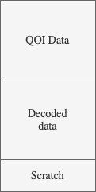
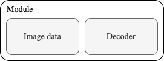
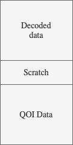

# QOI WASM

A [QOI](https://qoiformat.org) decoder written in the WebAssembly Text Format (WAT)

## WAT

An implemention of the QOI decoder. This implementation is dependent on that the host can handle _Multi-Value Wasm_. Included is a compiled WAT to WASM file that can be instantiated to decode images. Demo is deployed [here](https://martinericsson.github.io/qoi-wasm/). _(Note the requirements for the browser noted below.)_

### Usage

The wasm module assumes that the QOI data, including the header, is stored at memory index 0 before decompression. To decompress the data call the decode method, e.g.,

```
const header = wasm.instance.exports.decode();
const [width, height, channels, colorspace, memoryOffset] = header;
```

Where the width will be greater than zero if the data is a valid QOI. The memoryOffsets names the index where the decompressed data starts in the now expanded memory area.



### Example

In the viewer folder is an example on how to use the module. To view the example you need a browser that supports the File API, works on Chrome at the moment, does not work on Safari. There are two .qoi files in the assets folder that can be used as test input. To run the example locally

> node serve.mjs

and point your compatible browser to [QOI Viewer](http://localhost:9999/src/viewer)

### Compiling

To compile the project, install the dependencies and run the compile script

> npm i

> npm run compile

The ouput is the decoder file called qoi.wasm.

## Inline



Another option is to inline the decompressor and the image data into a WASM module. After the module is loaded the instance exports a method called d (for decompress) and the memory (m) where the result will be after decompression. See below for memory layout, main difference here is that the decompressed data is stored at location 0.



### Usage

> npm run kombine file.qoi

If all goes well a new file will be written in the same folder as the src QOI file.

### Example

To see a runtime example running locally

> npm run serve

and go to [kombiner](http://localhost:9999/src/kombiner)

To try the compilation step

> npm run kombine ./assets/pixil-frame-0.qoi

and the compiled files will be stored in the assets folder.

```
Some example results. (sizes in bytes)


File                    PNG         QOI         QOI-WASM    QOI-WASM-BROTLI
pixil-frame-o           124         104         574         312
peerfeer_frame_rgba     1684359     1747735     1748220     1019745
```

## Dependencies

[The WebAssembly Binary Toolkit](https://www.npmjs.com/package/wabt) for compiling the WAT files to WASM.

[Brotli](https://www.npmjs.com/package/brotli) for compressing the inlined decompression module.
